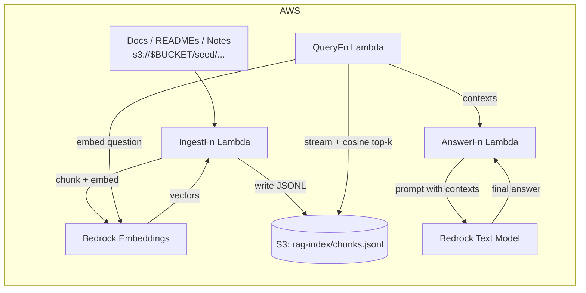

# Internal Stack Overflow (RAG)

Retrieval-augmented Q&A over your codebase using Amazon Bedrock and a lightweight S3-backed vector index — no OpenSearch or external vector database required.

**Architecture:** Git/Docs → Ingest Lambda → S3 JSONL index → Query Lambda (cosine search) → Answer Lambda (retrieval + LLM)

---

## ✨ What it does

- Indexes repository docs and markdown into a vector index using Amazon Titan Embeddings
- Retrieves top-k matching chunks via cosine similarity (pure Python) over an S3-hosted JSONL index
- Synthesizes a grounded answer using a Bedrock text model (Claude 3 Haiku or Titan Text Lite)
- Returns `{ answer, contexts, scores }` as JSON via API Gateway

---

## 🏗️ Architecture



---

## 📂 Repo structure

```
.
├─ ingest/          # Lambda: build index (Titan embeddings → S3 JSONL)
│  └─ handler.py
├─ query/           # Lambda: retrieval-only (cosine over S3 JSONL)
│  └─ handler.py
├─ answer/          # Lambda: retrieval + LLM synthesis (Bedrock text model)
│  └─ handler.py
├─ infra/           # AWS CDK (TypeScript)
│  ├─ bin/infra.ts
│  └─ lib/infra-stack.ts
└─ README.md
```

---

## ✅ Prerequisites

- AWS account with CLI configured: `aws sts get-caller-identity`
- Node.js 20+, npm, Docker (for CDK bundling)
- Python 3.11 (for local Lambda work)
- CDK bootstrapped once per account/region:
  ```bash
  npx aws-cdk@latest bootstrap
  ```
- Bedrock model access enabled in `us-east-1`:
  - Embeddings: `amazon.titan-embed-text-v1` (or `amazon.titan-embed-text-v2:0`)
  - Text model: `anthropic.claude-3-haiku-20240307-v1:0` (or `amazon.titan-text-lite-v1`)

> **Tip:** To skip the Anthropic access form, set `TEXT_MODEL_ID=amazon.titan-text-lite-v1` in the CDK stack.

---

## 🚀 Deploy

```bash
cd infra
npm i
npm run build
npx aws-cdk@latest deploy --require-approval never
```

The stack creates:
- S3 bucket for the vector index
- Lambdas: `IngestFn`, `QueryFn`, `AnswerFn`
- HTTP API (API Gateway) exposing `POST /query` and `POST /answer`
- Nightly re-index rule via EventBridge (03:00 UTC, optional)

Stack outputs include the API URL and bucket name.

---

## 📥 Populate seed docs & build the index

Sync your docs to S3, then trigger the ingest Lambda:

```bash
# Sync repo docs to the seed prefix
aws s3 sync . "s3://$BUCKET/seed/repo" \
  --exclude "*" \
  --include "README.md" \
  --include "docs/**/*.md" --include "docs/**/*.mdx" \
  --include "**/*.md" --include "**/*.txt" \
  --exclude ".git/*" --exclude ".venv/*" --exclude "node_modules/*" --exclude "cdk.out/*"

# Build a fresh index (truncate clears rag-index/* before writing)
aws lambda invoke \
  --function-name "$INGEST_FN" \
  --payload '{"truncate":true,"limit":5000}' \
  --cli-binary-format raw-in-base64-out \
  /tmp/ing.json >/dev/null && python3 -m json.tool /tmp/ing.json

# Inspect the first few rows
aws s3 cp "s3://$BUCKET/rag-index/chunks.jsonl" - | head -n 3
```

---

## 🔬 Smoke tests

**Retrieval only:**
```bash
curl -sS -X POST "$API/query" \
  -H 'Content-Type: application/json' \
  -d '{"question":"Describe the architecture and data flow of this project.","k":6}' \
  | python3 -m json.tool
```

**Full answer (retrieval + LLM synthesis):**
```bash
curl -sS -X POST "$API/answer" \
  -H 'Content-Type: application/json' \
  -d '{"question":"Describe the architecture and data flow of this project.","k":6}' \
  | python3 -m json.tool
```

---

## ⚙️ Configuration

Environment variables are injected into Lambdas via CDK:

| Variable | Default | Notes |
|---|---|---|
| `INDEX_BUCKET` | (stack output) | S3 bucket for the vector index |
| `INDEX_PREFIX` | `rag-index` | JSONL written to `${PREFIX}/chunks.jsonl` |
| `SEED_PREFIX` | `seed` | Where seed docs live in the bucket |
| `EMBED_MODEL_ID` | `amazon.titan-embed-text-v1` | Or `amazon.titan-embed-text-v2:0` |
| `TEXT_MODEL_ID` | `anthropic.claude-3-haiku-20240307-v1:0` | Or `amazon.titan-text-lite-v1` |
| `AWS_REGION` | `us-east-1` | Region for Bedrock + S3 |

---

## 🧼 Index hygiene

- Common build/dependency folders are excluded during ingest (`.git/`, `node_modules/`, `cdk.out/`, etc.)
- Identical chunk texts are de-duplicated across files within each run
- Truncate mode (`{"truncate": true}`) clears the existing index before writing, preventing stale data accumulation
- Default chunk size: ~800 chars with ~120 char overlap (tunable in `ingest/handler.py`)

---

## 🔐 Security

**Implemented by default:**
- Private S3 bucket with `BlockPublicAccess` enabled
- Least-privilege IAM roles scoped to Lambda functions
- Encryption at rest (S3 managed keys)
- HTTPS-only API endpoints

**Recommended before production deployment:**
- Add an API Gateway authorizer (AWS IAM, Cognito, or Lambda authorizer)
- Replace `allowOrigins: ["*"]` with your specific domain in `infra/lib/infra-stack.ts`
- Narrow Bedrock IAM policy from `resources: ["*"]` to specific model ARNs
- Enable API Gateway throttling with per-client quotas

---

## 💸 Cost profile

Costs are driven by S3 storage (single JSONL file), Lambda invocations, and Bedrock inference tokens. For modest codebases the ongoing cost is minimal. Compress the JSONL with gzip if the index grows large; disable nightly re-indexing when not in active use.

---

## 🛣️ Roadmap

- Web UI enhancements: show context scores, multi-turn chat
- Incremental index updates (avoid full re-index on small doc changes)
- Multi-region deployment pattern
- Support for additional embedding models (Cohere, Voyage AI)

---

## 🧹 Cleanup

```bash
cd infra
npx aws-cdk@latest destroy
```

---

## 📄 License

MIT
